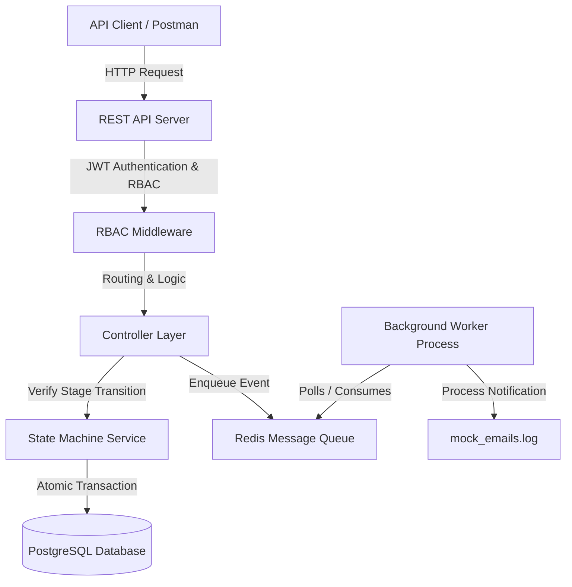
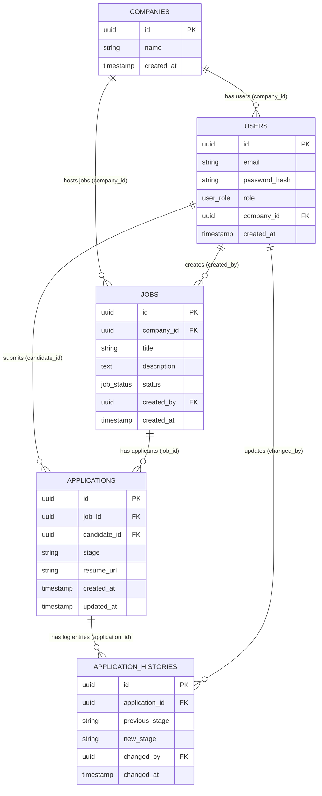

# Application Tracking System (ATS) Backend API

A production-grade, multi-tenant Job Application Tracking System (ATS) backend featuring Role-Based Access Control (RBAC), a strict unidirectional state machine for candidate evaluation pipelines, and asynchronous background worker processing via Redis queues.

---

## Architecture Overview



### 1. State Machine for Workflow Management
An application moves through a strict sequential pipeline to prevent corrupted business states.
- **Allowed Stages**: `Applied` $\rightarrow$ `Screening` $\rightarrow$ `Interview` $\rightarrow$ `Offer` $\rightarrow$ `Hired`.
- **Global Exit**: An application can transition to `Rejected` from *any* stage.
- **Enforcement**: Validated at the service layer prior to committing. Any out-of-order transition (e.g. `Applied` $\rightarrow$ `Offer`) is aborted, rolling back the transaction and returning a `400 Bad Request` with no side effects.

### 2. Multi-Tenant Role-Based Access Control (RBAC)
Routes are protected based on three distinct user roles:
- `candidate`: Submit resumes, list personal applications, and check current stages. Candidates *do not* belong to a company.
- `recruiter`: Create/update/delete job postings, list applicants, and advance application stages. Recruiters *must* belong to a company and can only modify jobs and applications associated with their company (tenant isolation).
- `hiring_manager`: View jobs, list applicants, and transition application stages. Managers *must* belong to a company and can only view/manage applications from their company.

### 3. Decoupled Asynchronous Processing (Message Queues)
Heavy notification tasks (e.g., sending emails) are offloaded to **Redis** via **BullMQ**.
- The main API enqueues a job payload (e.g. `{ candidate_email, job_title }`) and returns a `201 Created` response instantly ($<100\text{ms}$).
- A background worker process consumes the queue asynchronously, executing the task and appending a structured JSON log to `mock_emails.log` at the project root.
- Integrated retry mechanism with **exponential backoff** ensures network drops to the SMTP system do not lose notifications.

---

## Database Schema



---

## Setup & Running Guide

### Prerequisites
- [Docker](https://www.docker.com/) and [Docker Compose](https://docs.docker.com/compose/) installed.

### 1. Configure Environment
Copy the environment template file:
```bash
cp .env.example .env
```

### 2. Boot Services
Bring all services online in the background (PostgreSQL, Redis, REST API, Background Worker):
```bash
docker compose up -d --build
```
Verify that all containers are running successfully:
```bash
docker ps
```

### 3. Verify End-to-End Workflows
We provide a pre-configured integration script that registers a company, users, posts a job, applies, tests invalid transitions, performs valid transitions, and logs the output:
```bash
node verify_flow.js
```
Inspect the generated logs:
```bash
cat mock_emails.log
```

---

## Running Tests
Run the automated test suite locally to verify the state machine transitions and RBAC middleware boundary tests:
```bash
npm install
npm run test
```

---

## API Documentation

### 1. Authentication
| Method | Endpoint | Access | Description |
|---|---|---|---|
| `POST` | `/api/auth/companies` | Public | Register a new tenant company. Returns Company UUID. |
| `POST` | `/api/auth/register` | Public | Register a user. Validates company rule constraints based on role. |
| `POST` | `/api/auth/login` | Public | Authenticates credentials and returns a JWT token. |

### 2. Job Openings
| Method | Endpoint | Role | Description |
|---|---|---|---|
| `POST` | `/api/jobs` | Recruiter | Post a job. Tenant-enforced to recruiter's company. |
| `GET` | `/api/jobs` | Authenticated | List all jobs in the database. |
| `GET` | `/api/jobs/:id` | Authenticated | Fetch specific job details by ID. |
| `PUT` | `/api/jobs/:id` | Recruiter | Edit job details. Tenant-enforced. |
| `DELETE` | `/api/jobs/:id` | Recruiter | Delete a job listing. Tenant-enforced. |

### 3. Applications
| Method | Endpoint | Role | Description |
|---|---|---|---|
| `POST` | `/api/jobs/:jobId/applications` | Candidate | Submit application. Sets stage to `Applied` and enqueues notification. |
| `GET` | `/api/applications/me` | Candidate | Retrieve all applications submitted by candidate. |
| `GET` | `/api/applications/:applicationId` | Candidate/Staff | Retrieve single application details. Access limited to applicant or company staff. |
| `GET` | `/api/jobs/:jobId/applications` | Recruiter/Manager | Retrieve applications for job. Supports `?stage=[stage_name]` filtering. |
| `PUT` | `/api/applications/:applicationId/stage` | Recruiter/Manager | Transition applicant stage. Enforces state machine, updates tables in transaction, and enqueues event. |

---

## Key Technical Decisions & Tradeoffs

1. **Transactional Integrity for Stage Transitions**
   - *Choice*: Updates to the application's current stage and the audit trail entries in `application_histories` are wrapped in an atomic SQL transaction (`BEGIN`, `COMMIT`, `ROLLBACK`).
   - *Rationale*: If the audit trail fails to write, the stage transition must roll back to prevent desynchronized state records which can lead to compliance issues.

2. **Job Metadata in Queue Payload**
   - *Choice*: We pass basic text metadata (`candidate_email`, `job_title`) instead of just database IDs to the message queue.
   - *Rationale*: This avoids database lookups in the worker thread, reducing database connection strain and keeping worker execution fast. However, if job details were to change post-enqueuing, the email would capture the snapshot values at application time, which is usually desired behavior.

3. **Multi-Tenancy Schema (Shared Database, Separate Company Columns)**
   - *Choice*: All tenant data shares the same database and tables, partitioned by a foreign key `company_id`.
   - *Rationale*: Highly cost-effective and simple to manage/scale, protected by robust backend middleware enforcing `company_id` comparisons on every database query.
